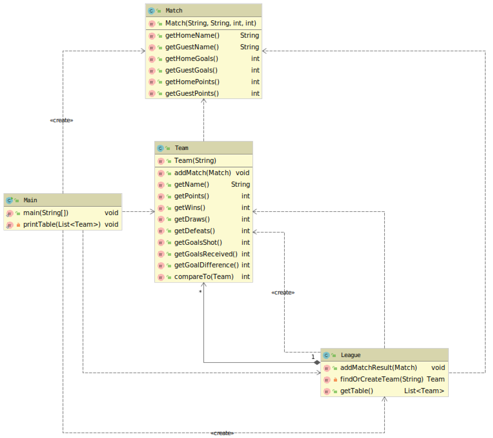
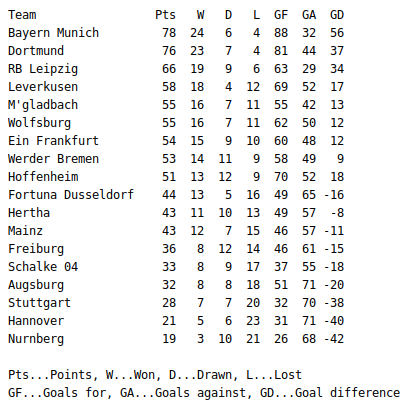

# Fußball-Liga

## Ziele

- Einfache Klassen in Java erstellen
- Eine CSV-Datei mit java.nio einlesen
- Objekte in einer Liste verwalten
- Das Interface `Comparable` implementieren und zur Sortierung der Liste verwenden

## Aufgabenstellung

Entwickeln Sie eine Anwendung zur Verwaltung von Fußball-Ligen. Der geforderte Aufbau der Applikation ist im folgenden Klassendiagramm dargestellt:

Die obigen Klassen sind folgendermaßen zu verwenden:

1. In der Klasse `Main` wird eine Liga angelegt. Außerdem werden die Spielergebnisse aus der Datei `bundesliga-1819.csv` eingelesen.
2. Für jedes Spielergebnis wird (in der Klasse `Main`) eine neue Instanz der Klasse `Match` angelegt und mit der Methode `League.addMatchResult()` zur Liga hinzugefügt.
3. `League.addMatchResult()` sucht das Heim- und das Gastteam in der Liste `teams` und ruft jeweils die Methode `Team.addMatch()` auf. Falls ein Team noch nicht vorhanden ist, wird es neu angelegt und zur Liste hinzugefügt.
4. In `Team.addMatch()` wird der Status des Teams auf Basis des erhaltenen Spielergebnisses aktualisiert. Dabei ist zu beachten, dass ein Team

  - drei Punkte erhält, wenn es ein Spiel gewinnt,
  - einen Punkt erhält, wenn es unentschieden spielt und
  - keinen Punkt erhält, wenn es ein Spiel verliert.

5. Abschließend wird in der Klasse `Main` mit der Methode `League.getTable()` auf die **sortierte** Teamliste zugegriffen. Auf Basis dieser Liste wird die abgebildete Tabelle auf der Konsole ausgegeben:

Die Sortierung der Teamliste soll über die Implementierung des Interfaces `Comparable` von `Team` erfolgen. Mithilfe von `Collections.sort(teams)` können die Teams dann in `League.getTable()` geordnet werden. Bei gleicher Punktezahl ist das Team mit dem besseren Torverhältnis vorzureihen.

**Wichtig:** Testen Sie die einzelnen Klasse bereits während der Entwicklung des Programms sorgfältig mit Unittests.
